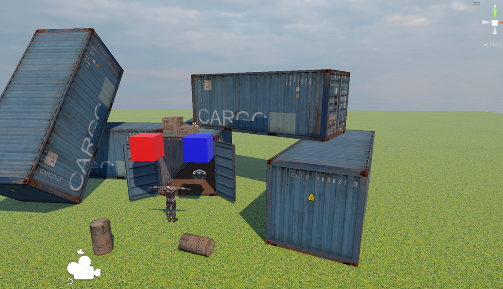
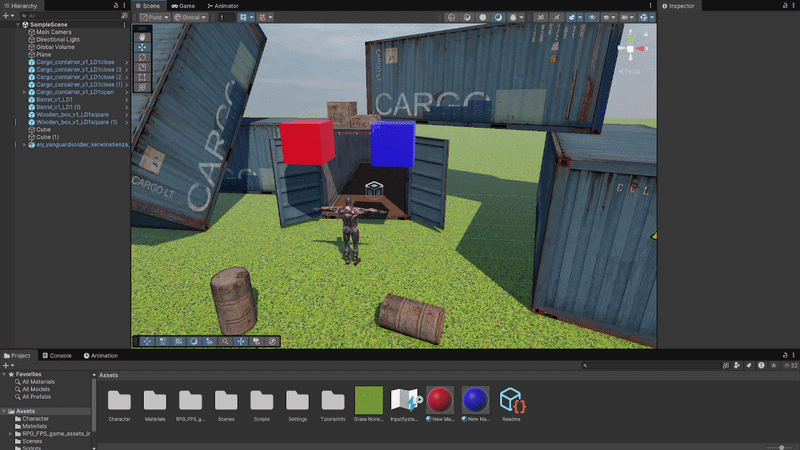
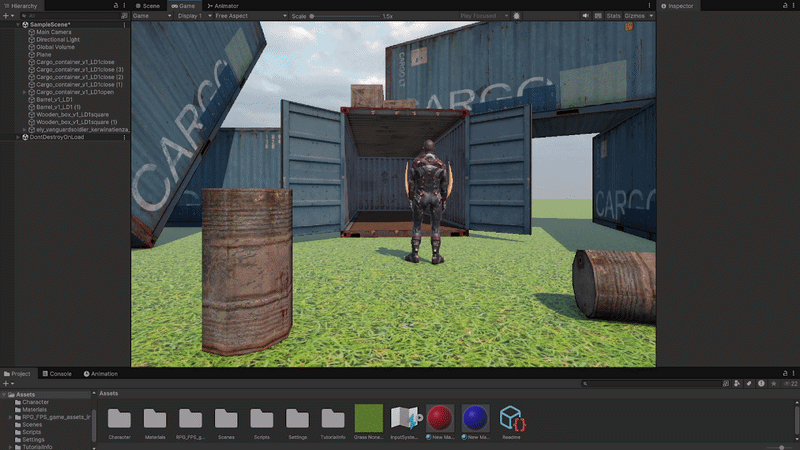

# GDV_3d

## Opdracht 1 3d environment

hier heb ik een screenshot van mijn 3d environment gemaakt in Universal Render Pipeline

## Opdracht 2 Movement Inputs

Input en movement van cubes

## Opdracht 3 Animation

Input Movement & animation on character

## Opdracht 4 Character Controller

Character controller movement and physics
